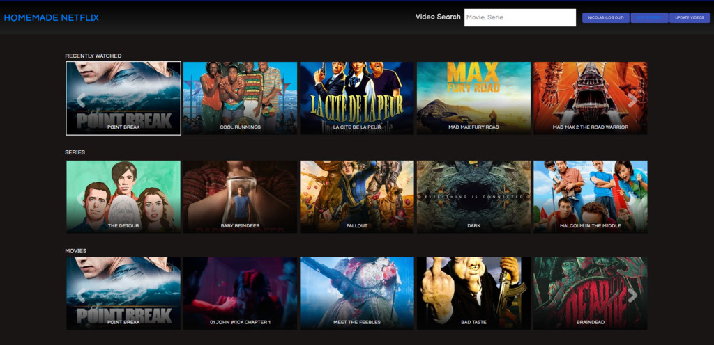

Intro
-------------------
This project is a video presentation server based on Django Rest Framework and React. It provides automatic video indexing and classification. 

Subtitles are added automatically if an adequate match is found. You can also upload you own subtitle or resync existing ones. Any input video format is supported as we reencode it to enable adaptive streaming (MPEG Dash).

How to use
-------------------

#### Installation (Docker)

You'll need to have [`docker`](https://docs.docker.com/install/) and [`docker-compose`](https://docs.docker.com/compose/install/) installed.

#### RUN

Pull the images:

    docker-compose -f docker-compose-prod.yml pull

Migrate the database:

    docker-compose -f docker-compose-prod.yml run --rm web ./wait-for-it.sh db:5432 -- python3 manage.py migrate

Run the server:

    docker-compose -f docker-compose-prod.yml up

Now the application should be accessible from your browser at `http://localhost:1337/streaming/`.

You can add torrent (see next section to configure torrent section password).

You need to create a account to update the database from the GUI (click on the login button)

#### CONFIGURATION

Change torrent admin password:

    docker-compose -f docker-compose-prod.yml run --rm nginx htpasswd -c /usr/torrent/.htpasswd admin

If you want to manually modify the data, you can access the admin page with a superuser account. For that, create one with the following command.

    docker-compose -f docker-compose-prod.yml run --rm web python3 manage.py createsuperuser

then go to `http://localhost:1337/admin/`.

The following variables can be configured in .env file:

    DJANGO_DATABASE_URL=postgres://postgres:password@db/streaming_server
    DJANGO_SECRET_KEY=fdj(re&lf87/qwm%jkiq78fdah346gsa
    POSTGRES_PASSWORD=password
    HTTPSTREAMING_HOST=www.foo.com
    SENTRY_DSN=https://foo.ingest.sentry.io/bar
    REACT_APP_SENTRY_DSN=https://foo.ingest.sentry.io/bar
    HIGH_LAYER_COMPRESSION_RATIO_IN_PERCENTAGE=7
    480P_LAYER_BITRATE=400000

#### Contributing

See the /doc folder for more informations on how to run a debug version of this app.

